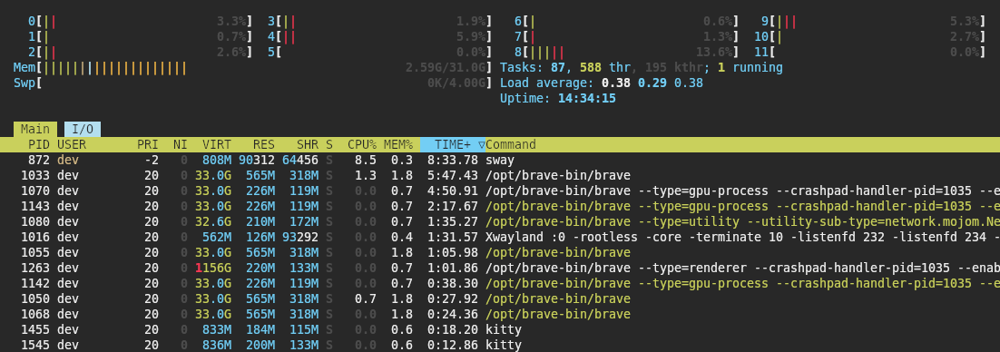

# Tender-Kitty

A <a href='https://github.com/kovidgoyal/kitty'>Kitty</a> color scheme inspired by the <a href='https://github.com/jacoborus/tender.vim'>tender_vim</a> color scheme.

## Installation

Replace the current color definitions in your [.config/kitty/theme.conf](https://github.com/dexpota/kitty-themes) configuration file with the content from the [theme.conf](./theme.conf) file.

## Screenshots

*Font: DejaVu Sans Mono 10pt*

## Contribution

<LeftMouse>lease report issues/bugs, feature requests and suggestions for improvements to the [issue tracker](https://github.com/compeng0001/tender-kitty/issues).
